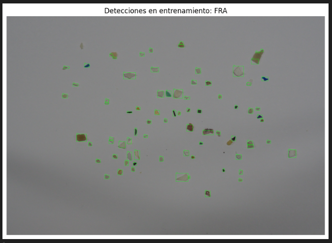

# Práctica 3 - Visión por Computador

Este documento recoge el desarrollo de la tercera práctica de la asignatura **Visión por Computador**.  
La práctica se centra en la **detección y reconocimiento de formas**, con dos tareas principales: identificación de monedas y clasificación de microplásticos utilizando técnicas de procesamiento de imágenes.

---

## Autores
- *Alberto José Rodríguez Ruano*  
- *Miguel Ángel Rodríguez Ruano* 

---

## Tarea 1 - Identificación y Conteo de Monedas con Diferenciación por Color

### Objetivo
Desarrollar un sistema que permita determinar la cantidad de dinero presente en una imagen mediante:
1. **Detección automática** de todas las monedas presentes
2. **Selección interactiva** de una moneda de referencia (1€) mediante clic
3. **Clasificación por valor** utilizando análisis de tamaño y color
4. **Cálculo del valor total** en euros y céntimos
5. **Visualización diferenciada** por color según el valor de las monedas

### Metodología Implementada

#### 1. Detección de Círculos con Transformada de Hough
Se utiliza la transformada de Hough para detectar círculos (monedas) en la imagen:

```python
# Preprocesamiento de la imagen
img_gray = cv2.cvtColor(img, cv2.COLOR_BGR2GRAY)
img_blurred = cv2.medianBlur(img_gray, 5)  # Reduce ruido

# Detección de círculos usando Hough
circles = cv2.HoughCircles(
    img_blurred, cv2.HOUGH_GRADIENT, 1, 100, 
    param1=100, param2=50, minRadius=10, maxRadius=150
)
circles = np.uint16(np.around(circles)) if circles is not None else None
```

#### 2. Interfaz de Selección por Clic
Sistema interactivo para selección de moneda de referencia mediante clic del ratón:

```python
# Función callback para detectar clic en moneda
def select_reference_coin(event, x, y, flags, params):
    global reference_coin
    if event == cv2.EVENT_LBUTTONDOWN and circles is not None:
        for idx, (cx, cy, r) in enumerate(circles[0, :]):
            if np.hypot(x - cx, y - cy) <= r:
                reference_coin = (cx, cy, r)
                # Marcar moneda seleccionada
                cv2.circle(display_img, (int(cx), int(cy)), int(r), (0, 0, 255), 3)
                cv2.putText(display_img, "1 Euro", (int(cx - 40), int(cy - r - 10)),
                            cv2.FONT_HERSHEY_TRIPLEX, 0.8, (0, 0, 255), 2)
                return

# Configurar ventana interactiva
cv2.namedWindow("clica en la moneda de 1€", cv2.WINDOW_NORMAL)
cv2.setMouseCallback("clica en la moneda de 1€", select_reference_coin)
```

#### 3. Establecimiento de Escala
Cálculo de correspondencia píxeles-milímetros usando moneda de 1€:

```python
# Diametros conocidos de las monedas en milímetros
COIN_DIAMETERS_MM = {
    1: 16.25,    # 1 céntimo
    2: 18.75,    # 2 céntimos  
    5: 21.25,    # 5 céntimos
    10: 19.75,   # 10 céntimos
    20: 22.25,   # 20 céntimos
    50: 24.25,   # 50 céntimos
    100: 23.25,  # 1 euro
    200: 25.75   # 2 euros
}

# Cálculo de tamaño real basado en referencia
radius_mm = r / reference_coin[2] * COIN_DIAMETERS_MM[100]
```

#### 4. Clasificación Multimodal (Tamaño + Color)
Análisis combinado para identificación precisa usando valores HSV:

```python
# Función de análisis de color en espacio HSV
def analyze_coin_color(x, y, patch_size=5):
    # Extrae parche de la imagen HSV y calcula promedio
    patch = img_hsv[y1:y2, x1:x2]
    mean_hsv = np.mean(patch, axis=(0, 1))
    h, s, v = mean_hsv  # OpenCV HSV: H 0-180, S/V 0-255
    
    # Normalización: h a 0-360°, s y v a 0-1
    h = h * 2
    s = s / 255.0
    v = v / 255.0
    
    # Clasificación por rangos HSV
    if s < 0.25:
        return "SILVER"  # Monedas plateadas (1€, 2€)
    elif 0 < h < 70 and s > 0.2 and v > 0.2:
        if h < 35:
            return "COPPER"  # Monedas cobrizas (1c, 2c, 5c)
        else:
            return "GOLD"    # Monedas doradas (10c, 20c, 50c)
    else:
        return "UNKNOWN"

# Grupos de monedas por color
COPPER_COINS = [1, 2, 5]      # Monedas cobrizas
GOLD_COINS = [10, 20, 50]     # Monedas doradas  
SILVER_COINS = [100, 200]     # Monedas plateadas/bimetálicas
```

#### 5. Visualización con Códigos de Color
Sistema de diferenciación visual según valor de las monedas:

```python
# Asignación de colores según valor de las monedas
for idx, value, color in final_classifications:
    cx, cy, r = circles[0, idx - 1]
    
    # Colores de bordes según grupo de valor
    if value in [1, 2, 5]:        # Monedas de bajo valor
        border_color = (0, 255, 255)  # Amarillo
    elif value in [10, 20, 50]:   # Monedas de valor medio
        border_color = (255, 0, 0)    # Azul  
    elif value in [100, 200]:     # Monedas de alto valor
        border_color = (0, 0, 255)    # Rojo

    # Dibujar círculo y etiquetas
    cv2.circle(img_final, (int(cx), int(cy)), int(r), border_color, 3)
    label = f"{value//100}eu" if value >= 100 else f"{value}ct"
    text = f"{label}  |  {color[:3]}  |  {radius_mm:.1f}mm"
```

### Características Técnicas

**Parámetros de Detección:**
- Método: Transformada de Hough para círculos
- Parámetros HoughCircles: dp=1, minDist=100, param1=100, param2=50
- Rango de radios: 10-150 píxeles
- Resolución de acumulador: 1 píxel

**Análisis de Color:**
- Espacio HSV para robustez ante iluminación
- Tamaño de parche inicial: 5x5 píxeles
- Tamaño de parche ampliado: 10x10 píxeles
- Puntos de muestreo: centro + 4 puntos radiales a 90% del radio

**Interfaz de Usuario:**
- Selección por clic del ratón en la moneda de 1€
- Ventana OpenCV redimensionable
- Feedback visual inmediato con círculo rojo
- Destrucción automática de ventanas

### Resultados Obtenidos

A continuación se presentan los resultados obtenidos tras aplicar el sistema de detección y clasificación de monedas sobre tres imágenes diferentes, con condiciones de iluminación y calidad variables.

#### Caso 1: Imagen en condiciones controladas

La primera imagen se tomó en un entorno controlado, con fondo blanco y buena iluminación.
El sistema detecta correctamente todas las monedas y clasifica de forma precisa tanto su valor como su color.


---

#### Caso 2: Imagen tomada con el móvil (sombras y reflejos pronunciados)

En esta captura, realizada con la cámara del móvil, aparecen **sombras y reflejos** que dificultan la segmentación y el análisis de color.
El sistema muestra varios errores de clasificación, confundiendo algunas monedas de diferente color y valor.


---

#### Caso 3: Imagen móvil con sombras moderadas

En esta imagen también existen sombras y reflejos.
El sistema logra **clasificar correctamente la mayoría de las monedas**, fallando únicamente en una, lo que demuestra una buena **robustez ante variaciones lumínicas**.


## Tarea 2 - Clasificación de Microplásticos mediante Características Geométricas

### Objetivo

El propósito de esta segunda tarea es desarrollar un sistema de **clasificación automática de microplásticos** a partir de las 3 imágenes proporcionadas, utilizando **características geométricas y visuales** extraídas de las partículas observadas.  
El sistema debe ser capaz de aprender patrones de tres tipos de partículas —**fragmentos (FRA)**, **pellets (PEL)** y **alquitrán (TAR)**— y posteriormente **clasificar objetos desconocidos** en una imagen de test (*MPs_test.jpg*), evaluando su desempeño mediante métricas estándar y una **matriz de confusión**.

---

### Metodología Implementada

#### 1. Extracción de Máscaras Binarias

Para segmentar las partículas se emplea un proceso robusto basado en:
- **Ecualización adaptativa del canal de luminancia (CLAHE)** para compensar iluminación no uniforme.  
- **Umbralización adaptativa** (método de Gauss) para aislar regiones relevantes.  
- **Operaciones morfológicas** (cerrado y apertura elíptica) para limpiar ruido.  
- **Relleno de agujeros** mediante *flood fill*.

```python
def build_binary_mask(img_bgr, morph_kernel_size=5):
    lab = cv2.cvtColor(img_bgr, cv2.COLOR_BGR2LAB)
    l, a, b = cv2.split(lab)
    clahe = cv2.createCLAHE(clipLimit=2.5, tileGridSize=(8,8))
    l_eq = clahe.apply(l)
    img_eq = cv2.cvtColor(cv2.merge([l_eq, a, b]), cv2.COLOR_LAB2BGR)
    blur = cv2.bilateralFilter(cv2.cvtColor(img_eq, cv2.COLOR_BGR2GRAY), 9, 75, 75)
    mask = cv2.adaptiveThreshold(blur, 255, cv2.ADAPTIVE_THRESH_GAUSSIAN_C,
                                 cv2.THRESH_BINARY_INV, 35, 5)
    # Refinado morfológico
    kernel = cv2.getStructuringElement(cv2.MORPH_ELLIPSE, (morph_kernel_size, morph_kernel_size))
    mask_clean = cv2.morphologyEx(mask, cv2.MORPH_CLOSE, kernel)
    mask_clean = cv2.morphologyEx(mask_clean, cv2.MORPH_OPEN, kernel)
    flood = mask_clean.copy()
    h,w = flood.shape[:2]
    mask_ff = np.zeros((h+2,w+2), np.uint8)
    cv2.floodFill(flood, mask_ff, (0,0), 255)
    mask_final = mask_clean | cv2.bitwise_not(flood)
    return img_eq, mask_final
```

#### 2. Detección y Filtrado de Contornos
Filtrado por área e intersección (IoU) para eliminar solapamientos y ruido.
```python
ef detectar_contornos_validos(img, min_area=300, max_area=10000, solapamiento_minimo=True):
    """Detecta contornos válidos usando build_binary_mask y filtrado posterior"""
    img_eq, mask = build_binary_mask(img)
    contours,_ = cv2.findContours(mask, cv2.RETR_EXTERNAL, cv2.CHAIN_APPROX_SIMPLE)
    contours = [c for c in contours if min_area <= cv2.contourArea(c) <= max_area]

    to_remove = set()
    for i in range(len(contours)):
        for j in range(i+1,len(contours)):
            val = iou_boxes(cv2.boundingRect(contours[i]), cv2.boundingRect(contours[j]))
            if val>0:
                if cv2.contourArea(contours[i]) < cv2.contourArea(contours[j]): 
                    to_remove.add(i)
                else: 
                    to_remove.add(j)

    return [c for k,c in enumerate(contours) if k not in to_remove]
```

#### 3. Extracción de Características
Ocho descriptores geométricos y visuales basados en el trabajo *SMACC (2020)*: área, perímetro, compacidad, relación área/rectángulo, aspecto, ejes, distancias al centroide y intensidad media de color respecto al negro (para textura/coloración).
```python
def extraer_features_contornos(img, contours):
    gray = cv2.cvtColor(img, cv2.COLOR_BGR2GRAY)
    features, rects = [], []
    for c in contours:
        area = cv2.contourArea(c)
        if area==0: continue
        perimetro = cv2.arcLength(c, True)
        x,y,w,h = cv2.boundingRect(c)
        rel_aspecto = w/h if h else 0
        rel_area_cont = area/(w*h) if w*h else 0
        compact = (perimetro**2)/(4*np.pi*area)
        rel_ejes = 0
        if len(c)>=5:
            try: (xc,yc),(MA,ma),ang=cv2.fitEllipse(c); rel_ejes=ma/MA if MA else 0
            except: rel_ejes=0
        M = cv2.moments(c)
        cx,cy=(int(M["m10"]/M["m00"]), int(M["m01"]/M["m00"])) if M["m00"] else (0,0)
        dists=[np.linalg.norm(np.array([cx,cy])-pt[0]) for pt in c]
        rel_dist_centroid=min(dists)/max(dists) if dists and max(dists)!=0 else 0
        mask_obj = np.zeros(gray.shape,np.uint8)
        cv2.drawContours(mask_obj,[c],-1,255,-1)
        mean_color = cv2.mean(img, mask=mask_obj)[:3]
        black_dist = np.linalg.norm(np.array(mean_color)-np.array([0,0,0]))
        features.append([area, perimetro, compact, rel_area_cont,
                         rel_aspecto, rel_ejes, rel_dist_centroid, black_dist])
        rects.append((x,y,w,h))
    return np.array(features), rects
```

#### 4. Entrenamiento y Clasificación
Se construye un conjunto de entrenamiento a partir de tres imágenes, una por clase:

- *FRA*: fragmentos irregulares

- *PEL*: pellets esféricos

- *TAR*: partículas oscuras o alquitranadas

Para cada clase, se calculan las características de sus partículas y se normalizan (μ, σ).
La clasificación de nuevos objetos se realiza mediante una distancia euclídea ponderada, donde cada característica contribuye con un peso distinto en función de su relevancia empírica:

| Feature | Peso |
|----------|------|
| Área | 3.5 |
| Perímetro | 2.4 |
| Compacidad | 4.5 |
| Relación área/rectángulo | 2.25 |
| Relación de aspecto | 3.5 |
| Relación entre ejes | 4.0 |
| Relación distancias al centroide | 5.3 |
| Distancia al negro | 3.5 |

---

### Resultados Obtenidos

#### Entrenamiento - Detección de Objetos y Extracción de Características
  
  


#### Clasificación sobre Imagen de Test


#### Métricas y Matriz de Confusión

**Resultados globales:**  
- Accuracy = 0.8226
- Precision = 0.8685
- Recall = 0.8100
- F1=0.8290


---

### Conclusiones
El sistema logró una **tasa de acierto superior al 82%**, mostrando especial precisión en la clasificación de **fragmentos (FRA)**, mientras que las partículas tipo **TAR** y **pellets (PEL)** presentan mayor confusión. 
El pipeline demuestra la eficacia de combinar **características geométricas simples** con una **clasificación ponderada** para la identificación automática de microplásticos.
