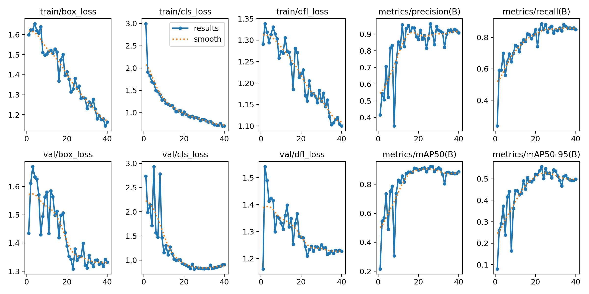

# 🚗 Práctica 4 — Detección de Vehículos y Matrículas

## 👥 Autores
- Alberto José Rodríguez Ruano  
- Miguel Ángel Rodríguez Ruano  

---

## 🧠 Descripción general
Este proyecto implementa un prototipo basado en visión por computador para la detección, seguimiento y anonimización (blur) de personas y vehículos en vídeo, incluyendo la localización de matrículas mediante modelos YOLO11 .  
El notebook principal es `VC_P4.ipynb`.

---

## 📚 Contenidos
- Objetivo  
- Estructura del notebook  
- Requisitos e instalación  
- Parámetros principales  
- Cómo ejecutar  
- Formato del CSV  
- Ejemplo rápido  
- Limitaciones y notas  
- Referencias  
- Fragmentos útiles  

---

## 🎯 Objetivo
Procesar un vídeo y realizar:
- Detección y seguimiento de personas y vehículos (YOLO11).
- Localización de matrículas dentro de vehículos (YOLO + EasyOCR opcional).
- Aplicar desenfoque selectivo sobre regiones sensibles.
- Exportar un vídeo anonimizado y un CSV con metadatos.

### Variantes
1. Sin OCR: detección + blur con YOLO.  
2. Con OCR: detección combinada YOLO + EasyOCR.

---

## 🧩 Estructura del notebook
- Configuración: rutas, modelos y umbrales.  
- Modelos:  
  - model_general (YOLO11n) para detección general.  
  - model_plate (best.pt) para matrículas.  
  - easyocr.Reader opcional.  
- Funciones utilitarias:  
  - blur_region()  
  - smooth_coords()  
  - detect_plate_with_ocr()  
  - merge_detections()  
- Loop principal: procesamiento de vídeo frame a frame con tracking BoT-SORT.

---

## 📂 Dataset utilizado

El conjunto de datos empleado para el entrenamiento del modelo YOLO destinado a la detección de matrículas está disponible en el siguiente enlace:

### 🔗 Descargar dataset:
https://drive.google.com/file/d/1MHEGWN_suCMlTrA9IHJFPZ2wKu8hqrGo/view?usp=sharing


---

## ⚙️ Resultados del entrenamiento




### 📉 Pérdidas (Losses)

| Métrica | Descripción | Tendencia |
|----------|--------------|-----------|
| **train/box_loss** | Error en la predicción de las cajas delimitadoras. | 🔻 Disminuye progresivamente. |
| **train/cls_loss** | Error al clasificar los objetos detectados. | 🔻 Disminuye rápidamente. |
| **train/dfl_loss** | Distribution Focal Loss (mejora precisión de cajas). | 🔻 Disminuye constante. |
| **val/box_loss** | Pérdida de cajas en validación. | 🔻 Disminuye, algo irregular. |
| **val/cls_loss** | Pérdida de clasificación en validación. | 🔻 Disminuye bien. |
| **val/dfl_loss** | Pérdida DFL en validación. | 🔻 Disminuye correctamente. |


### 📈 Métricas de Rendimiento

| Métrica | Descripción | Tendencia |
|----------|--------------|-----------|
| **metrics/precision(B)** | Proporción de detecciones correctas (evita falsos positivos). | 🔼 Sube hasta ~0.9 |
| **metrics/recall(B)** | Proporción de objetos detectados (evita falsos negativos). | 🔼 Sube hasta ~0.85 |
| **metrics/mAP50(B)** | Precisión promedio a IoU=0.5. | 🔼 Sube hasta ~0.9 |
| **metrics/mAP50-95(B)** | Precisión promedio a IoU entre 0.5 y 0.95 (más estricta). | 🔼 Sube hasta ~0.5 |

###  Conclusiones

- El modelo muestra **una clara convergencia**: las pérdidas bajan y las métricas suben.
- **No hay signos de sobreajuste**, ya que las curvas de validación siguen el mismo patrón que las de entrenamiento.
- Los valores finales de **mAP50 (~0.9)** y **mAP50-95 (~0.5)** indican **buen rendimiento en detección**.


---

## ⚙️ Requisitos e instalación
Crear entorno con Python 3.9:

```bash
conda create -n VC_P4 python=3.9 -y
conda activate VC_P4
pip install ultralytics opencv-python-headless numpy pandas easyocr torch torchvision
```


Notas:
- Si se desea usar GPU, instalar torch con CUDA desde pytorch.org.
- Si opencv-python-headless causa problemas, usar opencv-python.
- Si no se usa OCR, dejar USE_EASYOCR=False.

### Modelos requeridos
Colocar los pesos en la carpeta del notebook:
- yolo11n.pt → modelo general.
- best.pt → detector de matrículas.
- botsort.yaml → configuración del tracker.

---

## 🧰 Parámetros principales
Parámetro | Descripción | Valor por defecto
-----------|--------------|------------------
VIDEO_IN_PATH | Ruta del vídeo de entrada | C0142.MP4
VIDEO_OUT_PATH | Vídeo anonimizado | outputs/salida_anonimizada.mp4
CSV_OUT_PATH | CSV de detecciones | outputs/detecciones.csv
GENERAL_MODEL | Modelo YOLO general | yolo11n.pt
PLATE_MODEL | Modelo de matrículas | best.pt
CONF_THRESHOLD | Umbral de confianza | 0.25
BLUR_INTENSITY | Nivel de desenfoque | 61
USE_EASYOCR | Activar OCR auxiliar | False

Editar estos valores en las primeras celdas del notebook.

---

## ▶️ Cómo ejecutar
1. Abrir VC_P4.ipynb en Jupyter o VSCode.  
2. Asegurarse de que los pesos estén disponibles.  
3. Ejecutar las celdas en orden: configuración → carga de modelos → loop principal.  
4. Se generarán:
   - outputs/salida_anonimizada.mp4  
   - outputs/detecciones.csv  

Si USE_EASYOCR=True, EasyOCR refinará la detección de matrículas cada N frames.

---

## 📊 Formato del CSV generado
Cada fila representa una detección por frame:

Columna | Descripción
--------|-------------
frame | Número de frame
tipo_objeto | Clase detectada (person, car…)
confianza | Confianza de la detección
id_tracking | ID de seguimiento (BoT-SORT)
x1,y1,x2,y2 | Coordenadas de la caja
matricula_detectada | 1 si hay placa, 0 si no
conf_matricula | Confianza de la placa
metodo_deteccion | yolo, ocr o yolo+ocr
mx1,my1,mx2,my2 | Coordenadas de la caja de la placa

---

## ⚡ Ejemplo rápido
👤 Personas → se desenfocan completamente con blur_region.  
🚗 Vehículos → se detecta placa con model_plate.  
🔠 OCR → si está activo, EasyOCR refina detecciones y se fusiona con YOLO.  
📉 Suavizado → smooth_coords evita parpadeos entre frames.

---

## ⚠️ Limitaciones
- La calidad depende de la resolución y del modelo best.pt.
- EasyOCR añade carga computacional; se ejecuta cada N frames.
- Para CPU o vídeos largos, reducir FPS o subir CONF_THRESHOLD.
- Para lectura OCR avanzada, ver VC_P4b.ipynb.

---

## 📚 Referencias
- Ultralytics YOLO: https://github.com/ultralytics/ultralytics  
- EasyOCR: https://github.com/JaidedAI/EasyOCR  
- PyTorch: https://pytorch.org  
- ChatGPT: https://chat.openai.com  

---

## 💻 Fragmentos de código útiles

1️⃣ Configuración mínima:
```python
VIDEO_IN_PATH = "C0142.MP4"
VIDEO_OUT_PATH = "outputs/salida_anonimizada.mp4"
CSV_OUT_PATH = "outputs/detecciones.csv"
GENERAL_MODEL = "yolo11n.pt"
PLATE_MODEL = "best.pt"
CONF_THRESHOLD = 0.25
BLUR_INTENSITY = 61
USE_EASYOCR = True
```

2️⃣ Función de blur:
```python
def blur_region(img, x1, y1, x2, y2, intensity=BLUR_INTENSITY):
    h, w = img.shape[:2]
    x1, y1, x2, y2 = map(int, [max(0, x1), max(0, y1), min(w, x2), min(h, y2)])
    if x2 <= x1 or y2 <= y1:
        return img
    roi = img[y1:y2, x1:x2]
    k = intensity if (x2 - x1) > 30 else 15
    k = k if k % 2 == 1 else k + 1
    blurred = cv2.GaussianBlur(roi, (k, k), 0)
    img[y1:y2, x1:x2] = blurred
    return img
```

3️⃣ Combinar YOLO + OCR:
```python
def merge_detections(yolo_box, ocr_box):
    if yolo_box is None and ocr_box is None:
        return None
    if yolo_box is None:
        return ocr_box
    if ocr_box is None:
        return yolo_box
    yx1, yy1, yx2, yy2, yconf = yolo_box
    ox1, oy1, ox2, oy2, oconf = ocr_box
    return yolo_box if yconf > oconf else ocr_box
```

---

## 🖼️ Ejemplos visuales


# Enlace al vídeo (haz clic sobre el para redirigirte al video)

[](https://youtu.be/gq9PvOOwxQs)

Se hace blurr bien en las personas y en las matrículas detectadas

---

## 🧾 Notas finales
Este notebook constituye la parte principal del pipeline de visión de la práctica, y puede combinarse con el módulo VC_P4b para tareas de OCR avanzado y métricas.  
Ambos módulos conforman el flujo completo de detección, anonimización y análisis de matrículas.
