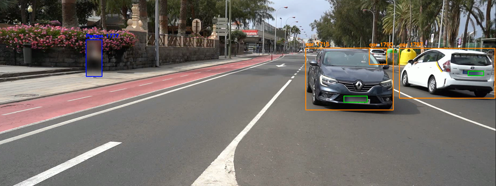
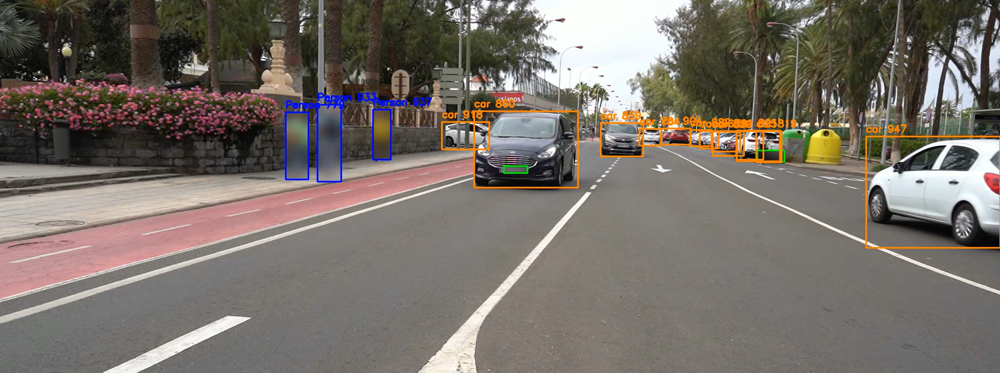

## Práctica 4. Detección de vehículos y matrículas

### Contenidos

[Tarea](#41-aspectos-cubiertos)  
[YOLO](#42-yolo)  
[Detectando](#43-detectando-desde-muestro-codigo)  
[Entrenando YOLO](#44-entrenando-yolo)  
[Entrega](#45-entrega)

# Práctica 4 — Detección de vehículos y matrículas (Notebook)

Este README resume el notebook `VC_P4.ipynb` que implementa un prototipo para la detección y el seguimiento de personas y vehículos en vídeo, así como la localización (y opcionalmente lectura) de matrículas. Está escrito siguiendo el mismo estilo técnico del README de la Práctica 3.

Contenido principal
- Objetivo y visión general
- Requisitos e instalación mínima
- Descripción de los modos disponibles en el notebook
- Parámetros principales y cómo ejecutar
- Salida y formatos generados
- Notas, limitaciones y extras sugeridos

## Objetivo

Construir un prototipo que procese un vídeo y realice:

- Detección y seguimiento de personas y vehículos (basado en modelos YOLO11).
- Localización de matrículas dentro de las cajas de vehículo (modelo YOLO para placas + opción de refuerzo por EasyOCR).
- Aplicación de un desenfoque (blur) sobre regiones sensibles: personas y matrículas.
- Exportación de un vídeo anotado (con blur) y un CSV con las detecciones y metadatos.

El notebook contiene dos variantes de pipeline:

1. Detección y blur sin OCR (solo localización de matrículas mediante el detector especializado).
2. Detección y blur con soporte OCR: se usa EasyOCR como apoyo para localizar la matrícula y combinar detecciones YOLO + OCR.

## Estructura del notebook

- Celdas de configuración: rutas de entrada/salida, modelos y umbrales.
- Inicialización de modelos:
	- `model_general` (YOLO11n) para detección general y tracking.
	- `model_plate` (modelo `best.pt`) para localizar placas.
	- (opcional) `easyocr.Reader` si se activa la opción OCR.
- Funciones utilitarias:
	- `blur_region(img, x1,y1,x2,y2, intensity)` — aplica GaussianBlur limitado a la ROI.
	- `smooth_coords(prev, new, alpha)` — suavizado exponencial de coordenadas entre frames.
	- `detect_plate_with_ocr(crop)` — usa EasyOCR para localizar regiones de texto (solo si USE_EASYOCR=True).
	- `merge_detections(yolo_box, ocr_box)` — combinación heurística YOLO+OCR.
- Loop principal de procesamiento de vídeo:
	- Lectura frame a frame usando la API de tracking de Ultralytics (BoT-SORT por defecto).
	- Aplicación de blur sobre personas y matrículas detectadas.
	- Escritura del frame resultante a `outputs/salida_anonimizada.mp4`.
	- Registro de eventos en `outputs/detecciones.csv`.

## Requisitos e instalación

Se recomienda un entorno con Python 3.9 (el notebook fue desarrollado y probado con 3.9.x). Instalar los paquetes mínimos:

```
conda create -n VC_P4 python=3.9 -y
conda activate VC_P4
pip install ultralytics opencv-python-headless numpy pandas easyocr torch torchvision
```

Notas:
- Para usar tracking y modelos YOLO con aceleración GPU, instale una versión de `torch` compatible con su CUDA siguiendo https://pytorch.org/get-started/locally/.
- Si `opencv-python-headless` causa inconvenientes con visualización en notebook, cambiar a `opencv-python`.
- Si no desea EasyOCR, puede dejar `USE_EASYOCR = False` en el notebook. EasyOCR se usa únicamente para localizar texto; la lectura completa de texto (OCR) no está integrada en el pipeline principal de este notebook.

Modelos necesarios (colocar en la misma carpeta del notebook o con rutas absolutas):

- `yolo11n.pt`  — modelo general (Ultralytics YOLO11, nombre por defecto en el notebook `GENERAL_MODEL`).
- `best.pt`     — modelo entrenado para detectar matrículas (referenciado como `PLATE_MODEL`).
- `botsort.yaml` (o el tracker que prefiera) — configuración utilizada por la API de tracking.

## Parámetros principales (editar en el notebook)

- `VIDEO_IN_PATH` — ruta al vídeo de entrada (ej. `C0142.MP4`).
- `VIDEO_OUT_PATH` — ruta del vídeo resultante con blur aplicado (por defecto `outputs/salida_anonimizada.mp4`).
- `CSV_OUT_PATH` — ruta del CSV de detecciones (por defecto `outputs/detecciones.csv`).
- `GENERAL_MODEL`, `PLATE_MODEL` — nombres de los pesos usados (ver arriba).
- `CONF_THRESHOLD` — umbral de confianza para detecciones de placas (por defecto 0.25).
- `BLUR_INTENSITY` — control del tamaño del kernel de blur aplicado.
- `USE_EASYOCR` — si True, activa la detección de regiones por EasyOCR (se ejecuta cada N frames para ahorrar tiempo).

Modificar estos parámetros está pensado para hacerse editando las primeras celdas del notebook y volviendo a ejecutar.

## Cómo ejecutar

1. Abrir `VC_P4.ipynb` en Jupyter / JupyterLab / VS Code.
2. Asegurarse de que los pesos (`yolo11n.pt`, `best.pt`) estén en la carpeta de trabajo o apuntar con rutas absolutas.
3. Ejecutar las celdas de configuración (primera celda) y, a continuación, la celda que inicia el loop principal.
4. El proceso escribirá:
	 - Un archivo de vídeo con las regiones desenfocadas en `VIDEO_OUT_PATH`.
	 - Un CSV con las detecciones en `CSV_OUT_PATH`.

También puede ejecutar la celda que usa OCR activando `USE_EASYOCR = True` para intentar mejorar la localización de la placa (combinado con detecciones YOLO).

## Formato del CSV generado

El CSV contiene, por fila, la información de detección por frame con las siguientes columnas:

- `frame` — número de frame
- `tipo_objeto` — clase detectada (person, car, ...)
- `confianza` — confianza de la detección del objeto
- `id_tracking` — identificador del track (BoT-SORT)
- `x1,y1,x2,y2` — coordenadas de la caja del objeto
- `matricula_detectada` — 1 si se localizó una placa dentro del vehículo, 0 en caso contrario
- `conf_matricula` — confianza de la detección de la placa
- `metodo_deteccion` — indica si la placa vino de `yolo`, `ocr` o `yolo+ocr`
- `mx1,my1,mx2,my2` — coordenadas de la caja de la placa (si detectada)

## Ejemplo rápido (resumen de comportamiento)

- Personas: se desenfocan completamente sus cajas con `blur_region`.
- Vehículos: se detecta la caja del vehículo; dentro de ella se busca la placa con `model_plate`; si `USE_EASYOCR=True` se intenta localizar (solo cada N frames para rendimiento) y se fusiona la detección.
- Las coordenadas de placa se suavizan por track_id para evitar parpadeos entre frames.

## Limitaciones y notas

- Calidad de detección de matrículas depende fuertemente de la resolución del recorte del vehículo y del modelo `best.pt` entrenado. Si las placas están muy pequeñas o borrosas, la detección y lectura serán malas.
- EasyOCR se usa como detector de texto auxiliar y puede añadir carga computacional; por eso en el notebook solo se ejecuta cada N frames.
- Si va a procesar vídeos largos o en CPU, considere reducir `fps` de salida, aumentar `CONF_THRESHOLD` o procesar una muestra de frames.
- Para lectura OCR completa y evaluación de texto (normalización y métricas) vea el notebook `VC_P4b/VC_P4b.ipynb` que contiene el ejercicio comparativo entre EasyOCR, Tesseract y PaddleOCR.

## Referencias

- Ultralytics YOLO: https://github.com/ultralytics/ultralytics
- EasyOCR: https://github.com/JaidedAI/EasyOCR
- Documentación PyTorch: https://pytorch.org/
- ChatGPT: https://chatgpt.com/
## Ejemplos y fragmentos de código

A continuación se incluyen fragmentos de código extraídos del notebook para facilitar su copia directa y prueba rápida.

1) Configuración mínima (edita según tus rutas y modelos):

```python
# Config
VIDEO_IN_PATH = "C0142.MP4"
VIDEO_OUT_PATH = "outputs/salida_anonimizada.mp4"
CSV_OUT_PATH = "outputs/detecciones.csv"

GENERAL_MODEL = "yolo11n.pt"
PLATE_MODEL = "best.pt"

CONF_THRESHOLD = 0.25
BLUR_INTENSITY = 61
USE_EASYOCR = True
```

2) Función de blur:

```python
def blur_region(img, x1, y1, x2, y2, intensity=BLUR_INTENSITY):
	h, w = img.shape[:2]
	x1, y1, x2, y2 = map(int, [max(0, x1), max(0, y1), min(w, x2), min(h, y2)])
	if x2 <= x1 or y2 <= y1:
		return img
	roi = img[y1:y2, x1:x2]
	k = intensity if (x2 - x1) > 30 else 15
	k = k if k % 2 == 1 else k + 1
	blurred = cv2.GaussianBlur(roi, (k, k), 0)
	img[y1:y2, x1:x2] = blurred
	return img
```

3) Combinar detecciones YOLO + OCR:

```python
def merge_detections(yolo_box, ocr_box):
	if yolo_box is None and ocr_box is None:
		return None
	if yolo_box is None:
		return ocr_box
	if ocr_box is None:
		return yolo_box

	# yolo_box: (x1,y1,x2,y2,conf)
	yx1, yy1, yx2, yy2, yconf = yolo_box
	ox1, oy1, ox2, oy2, oconf = ocr_box

	return yolo_box if yconf > oconf else ocr_box
```

## Imágenes de ejemplo del vídeo resultante



