# 🔤 Práctica 4b — Comparativa OCR sobre Matrículas

## 👥 Autores
- **Alberto José Rodríguez Ruano**  
- **Miguel Ángel Rodríguez Ruano**

---

## 🧠 Descripción general

Este módulo complementa la **Práctica 4 de Visión por Computador**, y tiene como objetivo **evaluar y comparar distintos motores OCR (EasyOCR y Tesseract)** aplicados a un conjunto de recortes de matrículas.

El notebook principal [`VC_P4b.ipynb`](https://github.com/maikos08/VC-ULPGC/blob/main/VC_P4/P4b/VC_P4b.ipynb) realiza:

- 🔹 Extracción de recortes a partir de etiquetas YOLO.  
- 🔹 Preprocesado y lectura con **EasyOCR** y **Tesseract**.  
- 🔹 Normalización y cálculo de métricas (**Levenshtein**, accuracy carácter).  
- 🔹 Generación de CSV y ejemplos visuales comparativos.  

---

## 📁 Estructura del proyecto

| Carpeta / Archivo | Descripción |
|--------------------|-------------|
| [`VC_P4b.ipynb`](https://github.com/maikos08/VC-ULPGC/blob/main/VC_P4/P4b/VC_P4b.ipynb) | Notebook principal con bloques numerados: configuración, carga de modelos, OCR por imagen, métricas y pipeline de vídeo. |
| [`ejemplos/`](https://github.com/maikos08/VC-ULPGC/tree/main/VC_P4/P4b/ejemplos) | Imágenes de ejemplo generadas durante la ejecución (`0116GPD.png`, `0290KWT.png`, etc.). |
| [`ocr_comparison_results/`](https://github.com/maikos08/VC-ULPGC/tree/main/VC_P4/P4b/ocr_comparison_results) | Resultados del procesamiento: `comparativa_ocr.csv`, `comparativa_grafica.png`, `ejemplos/`. |
| [`outputs/`](https://github.com/maikos08/VC-ULPGC/tree/main/VC_P4/P4b/outputs) | Resultados del pipeline de vídeo: `detecciones_ocr.csv`, `salida_con_ocr.mp4`. |

---

## ⚙️ Requisitos mínimos

Ejecutar en un entorno virtual limpio (ejemplo con **conda**):

```bash
conda create -n VC_P4b python=3.9 -y
conda activate VC_P4b
pip install opencv-python numpy matplotlib pandas easyocr pytesseract torch
```

También es necesario instalar **Tesseract OCR** y configurar su ruta en el notebook:

```python
TESSERACT_PATH = r"C:\Program Files\Tesseract-OCR\tesseract.exe"
```

> 💡 En Linux/Mac, asegúrate de que `tesseract` esté disponible en el `PATH`.

---

## 🚀 Guía rápida de uso

1. **Abre el notebook:**  
   [`VC_P4b.ipynb`](https://github.com/maikos08/VC-ULPGC/blob/main/VC_P4/P4b/VC_P4b.ipynb)

2. **Edita la configuración inicial (BLOCK 1):**
   - `DATASET_DIR` → carpeta con el dataset de matrículas.  
   - `TESSERACT_PATH` → ruta a Tesseract OCR.  

3. **Ejecuta los bloques en orden:**
   - 🧩 **BLOQUE 1:** configuración y utilidades  
   - ⚙️ **BLOQUE 2:** carga de modelos (EasyOCR)  
   - 🔠 **BLOQUE 3:** funciones OCR (lectura y normalización)  
   - 🧪 **BLOQUE 4:** prueba con una imagen  
   - 📊 **BLOQUE 5:** procesamiento completo del dataset  
   - 📈 **BLOQUE 6:** estadísticas y gráficas  
   - 🎥 **BLOQUE 7:** OCR sobre vídeo

4. **Resultados generados automáticamente:**
   - `ocr_comparison_results/comparativa_ocr.csv`  
   - Ejemplos visuales en `ocr_comparison_results/ejemplos/`  
   - Vídeo procesado en `outputs/salida_con_ocr.mp4`  

---

## 🧩 Fragmentos útiles

### 🛠️ Configuración inicial
```python
DATASET_DIR = "../Matriculas"
LABELS_DIR = os.path.join(DATASET_DIR, "labels")
IMAGES_DIR = DATASET_DIR
TESSERACT_PATH = r"C:\Program Files\Tesseract-OCR\tesseract.exe"
OUTPUT_DIR = "ocr_comparison_results"
RESULTS_CSV = os.path.join(OUTPUT_DIR, "comparativa_ocr.csv")
SAVE_EXAMPLES = True
```

### 🔠 Normalización de texto OCR
```python
def clean_text(text):
    return re.sub(r"[^A-Z0-9]", "", text.upper())

def fix_common_errors(text):
    text = text.replace('O', '0').replace('I', '1').replace('Q', '0')
    return text

def normalize_plate(text, ground_truth=""):
    text = clean_text(text)
    text = fix_common_errors(text)
    return text
```

### 🖼️ Procesamiento por imagen
```python
def process_image_ocr(img_path, label_path, ground_truth, save_example=False):
    img = cv2.imread(img_path)
    yolo_coords = read_yolo_label(label_path)
    x1, y1, x2, y2 = yolo_to_bbox(yolo_coords, img.shape)

    x1_new = x1 + int((x2 - x1) * 0.10)
    crop = img[y1:y2, x1_new:x2].copy()
    crop_resized = cv2.resize(crop, None, fx=3, fy=3, interpolation=cv2.INTER_CUBIC)

    # EasyOCR
    results = reader.readtext(crop_resized, paragraph=True, detail=0)
    easy_raw = " ".join(results).upper()

    # Tesseract
    gray = cv2.cvtColor(crop_resized, cv2.COLOR_BGR2GRAY)
    _, enhanced = cv2.threshold(gray, 0, 255, cv2.THRESH_BINARY + cv2.THRESH_OTSU)
    tess_raw = pytesseract.image_to_string(enhanced, config="--oem 1 --psm 7 -l spa").strip().upper()

    # Normalizar
    easy_norm = normalize_plate(easy_raw, ground_truth)
    tess_norm = normalize_plate(tess_raw, ground_truth)
    return { 'easy_normalized': easy_norm, 'tess_normalized': tess_norm }
```

---

## 📊 Salidas esperadas

## Ejercicio con dataset

El CSV [`comparativa_ocr.csv`](https://github.com/maikos08/VC-ULPGC/blob/main/VC_P4/P4b/ocr_comparison_results/comparativa_ocr.csv) contiene:

- `imagen`, `ground_truth`, `easy_raw`, `easy_normalized`, `easy_accuracy`, `easy_levenshtein`, `easy_time`  
- `tess_raw`, `tess_normalized`, `tess_accuracy`, `tess_levenshtein`, `tess_time`

### Ejemplo visual:
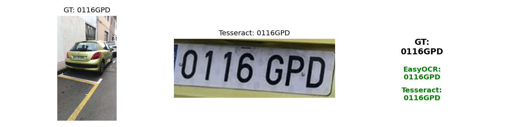
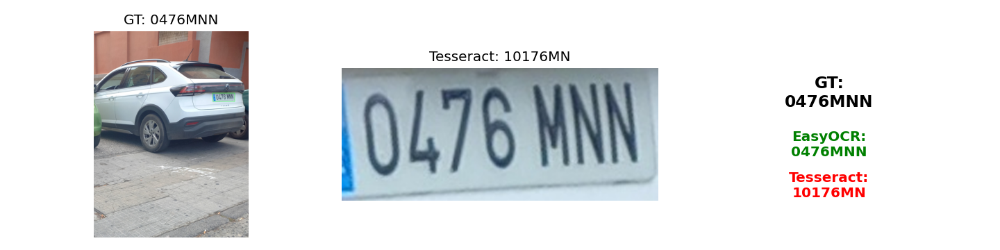

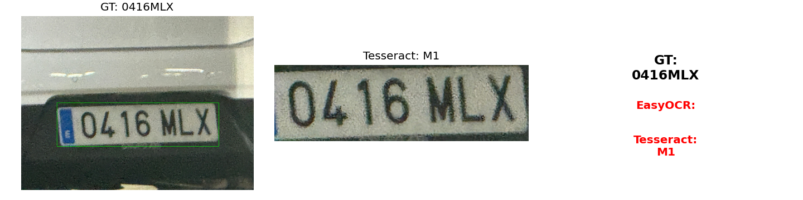

### Comparación final
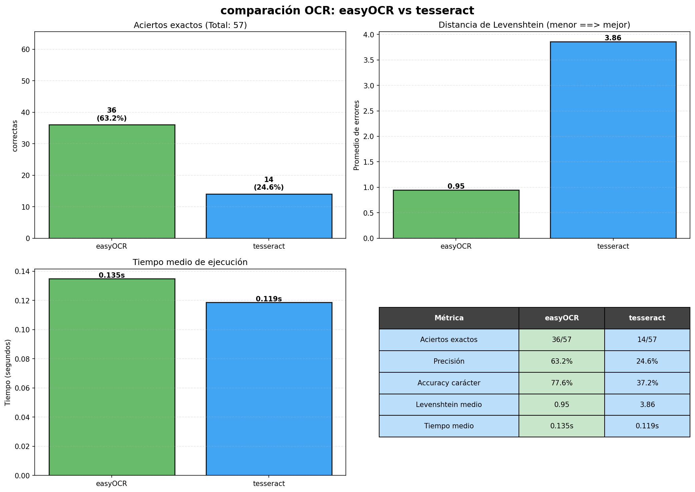


## Ejercicio con vídeo

### Enlace al vídeo (haz clic sobre el para redirigirte al video)

[](https://youtu.be/NpHFdu5RNl0)

En el vídeo no se detecta bien casi ninguna matrícula. Para ver lo que está pasando con cada frame en el video cogimos diferentes capturas para poder debuggear.


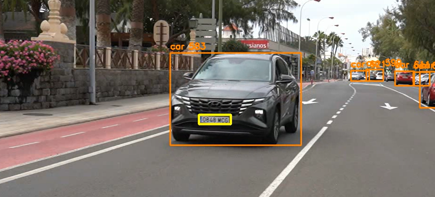
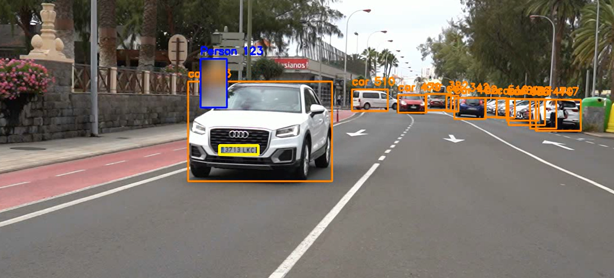
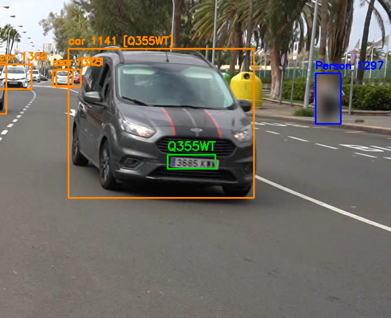
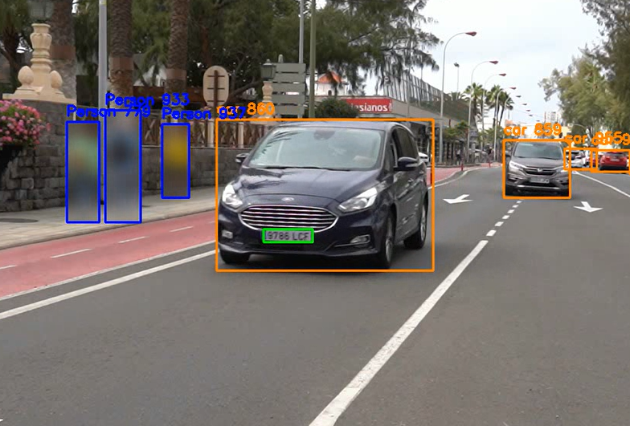

Estas capturas las pasamos por el modelo y entendimos que no las leía bien por el desenfoque del movimiento mientras se están moviendo los coches.

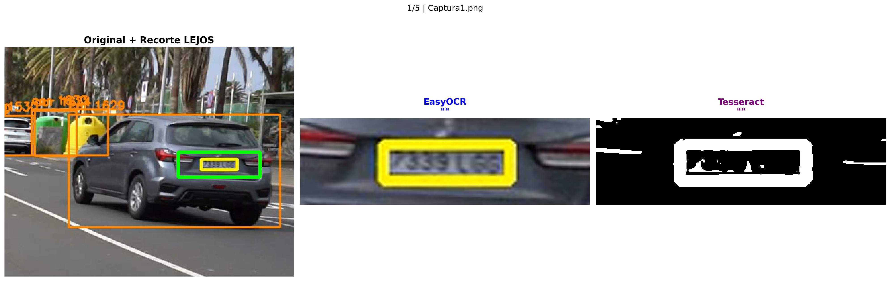
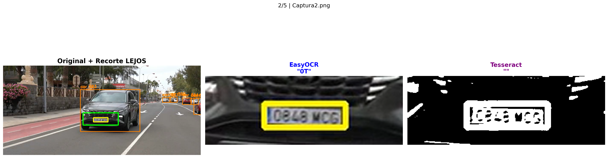
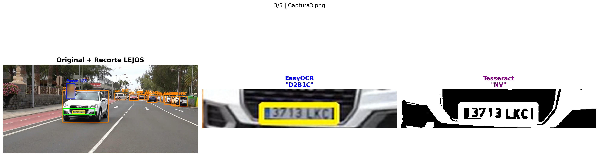
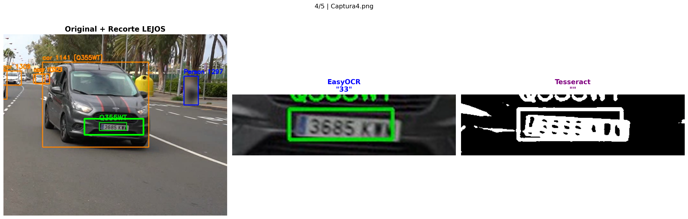
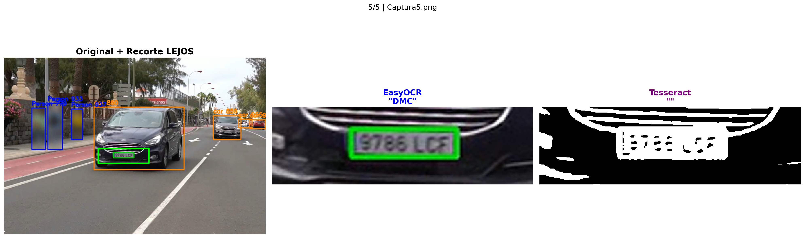
---

## 💡 Notas y recomendaciones

- Ajusta la variable `TESSERACT_PATH` según tu sistema operativo.  
- Si las lecturas OCR presentan ruido o repeticiones, prueba a:  
  - Aumentar el *zoom* (parámetros `fx`, `fy` en el `resize`).  
  - Aplicar técnicas de realce de contraste (CLAHE, top-hat, etc.).  
- Puedes implementar una heurística que elija entre **EasyOCR** y **Tesseract** según la distancia Levenshtein más baja respecto a un formato válido de matrícula.

---

> 🧠 **Consejo:** usa un entorno virtual y mantén los pesos y datasets organizados en carpetas separadas para evitar rutas rotas o conflictos de dependencias.
