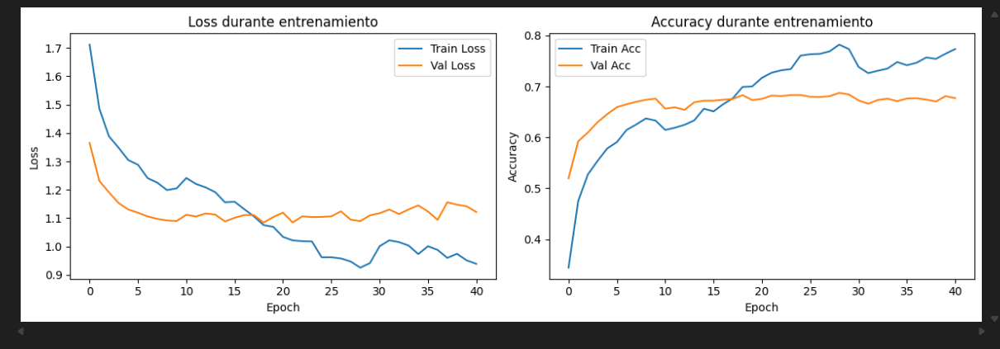

# P5-2 - Filtros de emoción con modelo propio

## Objetivo de la práctica

Desarrollar **un prototipo** de temática libre que provoquen
reacciones o efectos a partir de la información extraída del rostro. Uno
de los prototipos debe incluir el uso de un **modelo entrenado por
nosotros** para la extracción de información biométrica (en este caso,
clasificación de emociones faciales).

Este repositorio incluye:

1.  **Prototipo 1 (Climas emocionales)**: Usa nuestro
    modelo ResNet50 entrenado para clasificar 6 emociones y reacciona
    con fondos animados.
2.  **Prototipo 2 (Monos lado a lado)**: Compara la detección y
    clasificación de nuestro modelo con una visualización de "monos
    emocionales" en tiempo real, mostrando webcam y mono
    simultáneamente.

------------------------------------------------------------------------

## Qué hay en esta carpeta

    P5/
    ├── VC_P5_emotion_detector.ipynb                  # Prototipo 1: fondos + efectos faciales
    ├── VC_P5_emotion_detector_monkeys.ipynb          # Prototipo 2: monos lado a lado
    ├── best_model_emotions.pth                       # Modelo ResNet50 entrenado (6 emociones)
    └── README.md

------------------------------------------------------------------------

## Requisitos

Se recomienda usar un entorno conda. Instalación de dependencias:

    conda create -n VC_P5_emotions python=3.11
    conda activate VC_P5_emotions

    # OpenCV + PyTorch
    pip install opencv-python
    pip install torch torchvision torchaudio
    pip install numpy matplotlib

    # DeepFace (detección facial)
    pip install deepface
    pip install tf-keras  # necesario para TensorFlow 2.20+
------------------------------------------------------------------------

## Dataset Utilizado

Hemos utilizado este dataset:

https://drive.google.com/file/d/1PhX7oIvhZqzj74YIjbRxfXCpUKGnaEre/view?usp=sharing

------------------------------------------------------------------------

## 📊 Resultados del entrenamiento del modelo

El modelo ResNet50 fue entrenado para la clasificación de **6 emociones faciales**
(angry, fear, happy, neutral, sad, surprise), utilizando *fine-tuning parcial* sobre
pesos preentrenados en ImageNet.

A continuación se muestra la gráfica de pérdida (*loss*) y precisión (*accuracy*)
para entrenamiento y validación:

---

### 🧠 Análisis técnico de las curvas

#### **1. Curvas de pérdida (Loss)**  
En la gráfica izquierda se observa:

- **Train Loss**: desciende progresivamente desde ~1.75 hasta valores cercanos a 0.9,
  indicando una reducción sostenida del error durante la optimización.
- **Validation Loss**: disminuye inicialmente (1.35 → ~1.1), pero se estabiliza entre
  1.1 y 1.15, con fluctuaciones pequeñas en épocas posteriores.

**Interpretación técnica:**

- El modelo muestra **convergencia sólida**, sin oscilaciones abruptas.
- La validación entra en un régimen **estacionario** tras ~10 épocas.
- Aparece un **overfitting leve** a partir de la época 15: el train loss continúa
  bajando mientras que el val loss deja de mejorar, comportamiento habitual en
  clasificadores de emociones por la alta variabilidad del gesto facial.

---

#### **2. Curvas de precisión (Accuracy)**  
En la gráfica derecha:

- **Train Accuracy** progresa desde ~0.35 hasta ~0.78, evidencia del aprendizaje
  efectivo en las capas superiores finamente ajustadas.
- **Validation Accuracy** alcanza rápidamente ~0.67 en las primeras épocas y se
  mantiene estable entre 0.66 y 0.69 durante el resto del entrenamiento.

**Interpretación:**

- El modelo presenta una **generalización aceptable**, sin caídas bruscas en val_acc.
- El “gap” de ~10–12% entre entrenamiento y validación indica un **sobreajuste leve**,
  pero dentro del rango normal para datasets de expresiones faciales sin
  augmentations agresivos.
- La estabilidad constante de la validación sugiere que el modelo ha alcanzado su
  **capacidad representativa máxima** con la configuración actual.

----------------------------------

## Prototipo 1 --- Climas emocionales + efectos faciales

### Descripción

-   **Propósito**: Demostrar un sistema completo de reacción emocional
    usando un modelo de deep learning propio (ResNet50) para clasificar
    6 emociones (angry, fear, happy, neutral, sad, surprise) y generar
    efectos visuales en tiempo real.
-   **Comportamiento**:
    -   Detecta la cara con DeepFace (backend opencv).
    -   Clasifica la emoción con el modelo ResNet50 entrenado.
    -   Dibuja un **fondo animado** según la emoción (sol para happy,
        lluvia para sad, llamas para angry, etc.).
    -   Marca la cara con **HUD en esquinas**.

### Fragmento de código (bucle principal resumido)

    while True:
        ret, frame = cap.read()
        if not ret:
            break

        frame = cv2.flip(frame, 1)
        orig_frame = frame.copy()
        label = "neutral"
        face_box = None

        # 1. Detectar cara con DeepFace
        try:
            detections = DeepFace.extract_faces(
                img_path=orig_frame,
                detector_backend="opencv",
                enforce_detection=False
            )
            if len(detections) > 0:
                det = detections
                fa = det["facial_area"]
                x, y, w, h = fa["x"], fa["y"], fa["w"], fa["h"]
                face_box = (x, y, w, h)
                face_bgr = orig_frame[y:y+h, x:x+w]
                label, probs = predict_emotion(face_bgr)
        except Exception:
            label = "neutral"

        # 2. Pintar fondo según emoción
        draw_emotion_background(frame, label)

        # 3. Restaurar cara + HUD + efectos
        if face_box is not None:
            x, y, w, h = face_box
            face_roi = orig_frame[y:y+h, x:x+w]
            frame[y:y+h, x:x+w] = face_roi
            draw_face_hud_and_halo(frame, x, y, w, h)
            draw_face_effects(frame, x, y, w, h, label)

        cv2.imshow("Emotion Backgrounds + Effects", frame)
        if cv2.waitKey(1) & 0xFF == ord('q'):
            break

## Gif Demo de clima por emoción

------------------------------------------------------------------------

## Prototipo 2 --- Monos lado a lado (comparativa)

### Descripción

-   **Propósito**: Comparar visualmente la detección y clasificación de
    nuestro modelo ResNet50 con una representación simbólica (imágenes
    de "monos" según emoción). Permite evaluar la precisión del modelo
    de forma intuitiva.
-   **Comportamiento**:
    -   Lado izquierdo: webcam con rectángulo verde alrededor de la cara
        detectada + texto con emoción y FPS.
    -   Lado derecho: imagen del mono correspondiente a la emoción
        detectada (con suavizado temporal para evitar cambios bruscos).

### Fragmento de código (bucle principal resumido)

    historial = deque(maxlen=5)

    while True:
        ret, frame = cap.read()
        if not ret:
            break

        frame = cv2.flip(frame, 1)
        orig_frame = frame.copy()
        annotated_frame = frame.copy()
        label = "neutral"

        # 1. Detectar cara y clasificar emoción
        try:
            detections = DeepFace.extract_faces(
                img_path=orig_frame,
                detector_backend="opencv",
                enforce_detection=False
            )
            if len(detections) > 0:
                det = detections
                fa = det["facial_area"]
                x, y, w, h = fa["x"], fa["y"], fa["w"], fa["h"]
                face_bgr = orig_frame[y:y+h, x:x+w]
                label, probs = predict_emotion(face_bgr)
                cv2.rectangle(annotated_frame, (x, y), (x+w, y+h), (0, 255, 0), 2)
        except Exception:
            label = "neutral"

        # 2. Suavizado temporal
        historial.append(label)
        label_suavizado = Counter(historial).most_common(1)

        # 3. Obtener mono y combinar lado a lado
        mono_key = emotion_to_mono.get(label_suavizado, "neutral")
        mono_img = monos.get(mono_key, monos.get('neutral'))
        mono_resized = redimensionar_imagen(mono_img, annotated_frame.shape)

        if mono_resized is not None:
            combined = np.hstack((annotated_frame, mono_resized))
        else:
            combined = annotated_frame

        cv2.imshow('Espejo con el mono (Modelo propio)', combined)
        if cv2.waitKey(1) & 0xFF == ord('q'):
            break

### Mapeo de emociones a monos

    emotion_to_mono = {
        "angry": "enfadado",
        "fear": "sorprendido",
        "happy": "feliz",
        "neutral": "neutral",
        "sad": "pensando",
        "surprise": "sorprendido"
    }

## Gif Demo de monos

------------------------------------------------------------------------

## Detalles del modelo

### Arquitectura: ResNet50 + cabecera personalizada

    base = models.resnet50(weights=models.ResNet50_Weights.IMAGENET1K_V1)
    base.fc = nn.Sequential(
        nn.Dropout(0.5),
        nn.Linear(2048, 512),
        nn.ReLU(),
        nn.BatchNorm1d(512),
        nn.Dropout(0.4),
        nn.Linear(512, 6)
    )

### Preprocesamiento de entrada

-   Tamaño: 224×224
-   Escala de grises → 3 canales
-   Normalización ImageNet

------------------------------------------------------------------------

## Comparación con MediaPipe

El enfoque propuesto usa: - **DeepFace** para detección facial. -
**ResNet50** para clasificación end-to-end.

MediaPipe usa landmarks + reglas heurísticas para deducir emociones.

------------------------------------------------------------------------

## Créditos

-   ResNet50 (PyTorch)
-   DeepFace backend OpenCV
-   Imágenes de monos (recursos libres)
-   Desarrollado para la asignatura de Visión por Computador

------------------------------------------------------------------------
