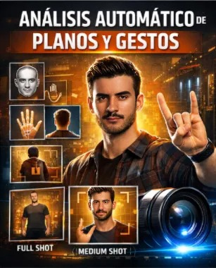

# Trabajo Final — **Sistema automático de cámara inteligente**

## *Sistema Autónomo de Encuadre Cinematográfico con Visión por Computador*



---

## 👥 Autores
- **Alberto José Rodríguez Ruano**  
- **Miguel Ángel Rodríguez Ruano**

---

## Objetivo del proyecto

Este **trabajo final** desarrolla un **sistema de encuadre cinematográfico inteligente en tiempo real**, capaz de analizar la **pose corporal, los gestos de mano y la orientación del sujeto** para tomar decisiones automáticas de cámara inspiradas en el **lenguaje cinematográfico clásico**.

El sistema actúa como un **operador de cámara virtual**, decidiendo de forma autónoma:

* el **tipo de plano** más adecuado (general, medio, primer plano, etc.)
* el **centro de seguimiento** del sujeto
* el **nivel de zoom**
* el **desplazamiento vertical del encuadre**
* la **estabilidad narrativa** mediante suavizado temporal y bloqueo (hold)

Todo ello se ejecuta **en tiempo real**, usando modelos **preentrenados de MediaPipe**, sin entrenamiento propio.

---

## Concepto general

Traduce información física del sujeto en **decisiones narrativas de cámara**.

El sistema combina:

* Visión por computador
* Heurísticas cinematográficas
* Interacción humano-máquina (gestos)
* Suavizado temporal para evitar jitter visual

El resultado es un prototipo funcional orientado a:

* producción audiovisual automatizada
* streaming
* investigación en IA creativa
* herramientas de apoyo a realización

---

## Qué hay en este repositorio

* `VC_proyecto.py`
  Script principal del sistema. Contiene:

  * inicialización de MediaPipe (pose, manos, cara)
  * sistema completo de clasificación de planos
  * detección automática basada en pose
  * control manual por gestos
  * sistema de suavizado y encuadre
  * interfaz visual con tres ventanas
  * soporte multi-cámara (selección dinámica de cámara activa; no mezcla simultánea)
  * captura de screenshots

* `/screenshots/`
  Carpeta creada automáticamente para guardar capturas.

---

## Requisitos

Se recomienda usar un entorno virtual.

Dependencias mínimas están especificadas en el archivo requierements, lo que se debería hacer es:

```bash
conda create -n camera_intelligent python=3.10
conda activate camera_intelligent

pip install -r requirements.txt
```

Hardware:

* Webcam (720p o superior)
* CPU moderna
* Soporte opcional para **dos cámaras simultáneas**

---

## Ejecución del sistema

Ejecutar directamente el script:

```bash
python VC_proyecto.py
```

Al iniciarse, el sistema:

1. Detecta cámaras disponibles (1 o 2)
2. Muestra un resumen completo de planos y controles
3. Abre tres ventanas independientes:

   * **CONTROL**
   * **DETECCIÓN**
   * **RESULTADO**

---

## Ventanas del sistema

### 1. Ventana DETECCIÓN

* Muestra el vídeo original
* Dibuja:

  * landmarks de pose (MediaPipe Pose)
  * landmarks de manos (MediaPipe Hands)
* Útil para depuración y comprensión del sistema

---

### 2. Ventana RESULTADO

* Muestra **únicamente el encuadre final**
* Aplica:

  * recorte dinámico
  * zoom según plano
  * suavizado temporal
* No muestra texto ni overlays
* Opcionalmente muestra **grid de composición (regla de los tercios)**

---

### 3. Ventana CONTROL

Panel lateral que muestra:

* FPS promedio
* número de cámaras
* modo activo (AUTO / MANUAL)
* estado del HOLD
* plano activo y plano detectado automáticamente
* orientación corporal (yaw, pitch, roll)
* controles disponibles
* recordatorio de gestos manuales
* estado del grid

---

## Sistema de planos cinematográficos

El sistema define un **diccionario explícito de planos**, cada uno con:

* factor de zoom
* nombre cinematográfico
* descripción narrativa
* offset vertical
* gesto manual asociado (si existe)
* criterio de detección automática

### Planos implementados

* Plano General Extremo
* Plano General
* Plano Entero
* Plano Americano
* Plano Medio
* Plano Medio Corto
* Primer Plano
* Primerísimo Primer Plano
* Sobre el Hombro (AUTO)
* Plano de Espaldas (AUTO)
* Picado (AUTO)
* Contrapicado (AUTO)

Este sistema está centralizado en la estructura `PLANOS`.

---

## Modos de control

### Modo AUTO (por defecto)

En este modo el sistema decide el plano automáticamente usando:

* ancho relativo de hombros
* visibilidad de caderas, rodillas y tobillos
* posición del sujeto dentro del frame
* orientación corporal (frontal, perfil, espaldas)

La lógica se implementa en la clase:

```python
BodyPositionDetector
```

Incluye:

* detección heurística
* buffer temporal (`deque`)
* suavizado por moda
* modo debug opcional

---

### Modo MANUAL (gestos de mano)

En modo manual, el usuario controla el plano mediante **gestos reconocidos por MediaPipe Hands**.

Gestos implementados:

* 👎 Pulgar abajo → Plano General Extremo
* ✊ Puño → Plano General
* ☝️ Un dedo → Plano Entero
* 🖖 Cuatro dedos → Plano Americano
* 🤟 Tres dedos → Plano Medio
* 🖐️ Mano abierta → Plano Medio Corto
* ✌️ Paz → Primer Plano
* 🤘 Rock & Roll → Primerísimo Primer Plano

La clasificación se realiza mediante:

* conteo de dedos
* detección explícita de gestos especiales

---

## HOLD — Bloqueo de encuadre

El sistema permite congelar el plano actual:

* Evita cambios automáticos
* Mantiene estabilidad narrativa
* Funciona tanto en AUTO como MANUAL

Se controla con la tecla:

```
h
```

---

## Seguimiento y suavizado del encuadre

El encuadre no cambia de forma brusca.

El sistema utiliza:

* una clase `SmoothFramer`
* interpolación progresiva entre estados
* suavizado configurable

Parámetros:

* centro X
* centro Y
* zoom

Esto evita jitter y saltos de plano no deseados.

---

## Centro de seguimiento inteligente

El punto de seguimiento cambia según el plano:

* Primeros planos → rostro
* Planos medios → cabeza + hombros
* Planos abiertos → centro corporal

Esto se implementa en:

```python
obtener_centro_seguimiento()
```

---

## Orientación corporal

Se calcula orientación 3D aproximada del torso:

* yaw
* pitch
* roll

Usando hombros y caderas en espacio 3D.

Los valores se:

* suavizan temporalmente
* muestran en el panel de control
* usan para decisiones automáticas (espaldas, perfil)

---

## Captura de screenshots

El sistema permite guardar el resultado final:

* tecla `s`
* guarda en `/screenshots`
* incluye:

  * timestamp
  * nombre del plano

---

## Controles del sistema

* `m` → cambiar AUTO / MANUAL
* `h` → activar/desactivar HOLD
* `s` → screenshot
* `g` → mostrar/ocultar grid
* `c` → cambiar cámara activa
* `r` → reset del sistema
* `ESC` → salir

---

## Bloques hechos para poder llegar al producto final

### 🔷 Bloque 1: Configuración Inicial y Detección Básica

**Objetivo**: Establecer la base del sistema con MediaPipe y detección simple de landmarks corporales.

**Componentes**:
* Inicialización de MediaPipe Pose
* Captura de video en tiempo real
* Visualización básica de landmarks (33 puntos del cuerpo)
* Frame único con detección sin procesamiento adicional

**Tecnologías**: `mediapipe`, `opencv-python`, `numpy`

**Lo que aprenderás**: Cómo MediaPipe detecta la pose humana y representa el cuerpo mediante coordenadas 3D normalizadas.


---

### 🔷 Bloque 2: Análisis de Distancia y Detección Automática de Planos

**Objetivo**: Clasificar automáticamente el tipo de plano cinematográfico según la distancia del sujeto a la cámara.

**Componentes**:
* Clase `DetectorPlanos` con heurísticas de clasificación
* Cálculo del **ancho de hombros** como métrica principal
* Análisis de **visibilidad de partes del cuerpo** (caderas, rodillas, tobillos)
* Sistema de **suavizado temporal** mediante buffer histórico
* 7 planos cinematográficos: desde *Extreme Wide* hasta *Extreme Close-up*
* Interfaz con **grid de composición** (regla de tercios)

**Lo que aprenderás**: Cómo traducir métricas corporales (ancho de hombros, visibilidad de landmarks) en decisiones cinematográficas automáticas.


---

### 🔷 Bloque 3: Control Manual con Gestos de Mano

**Objetivo**: Añadir control interactivo mediante reconocimiento de gestos manuales.

**Componentes**:
* Integración de **MediaPipe Hands** para detección de manos
* Clasificación de **8 gestos específicos**: puño cerrado, dedos levantados, paz, rock, pulgar abajo
* Lógica de **conteo de dedos** y detección de gestos especiales
* Cambio de plano en tiempo real según el gesto reconocido
* Panel lateral con **lista de gestos disponibles**

**Gestos implementados**:
* ✊ Puño → Plano General
* ☝️ 1 dedo → Plano Entero
* ✌️ Paz → Primer Plano
* 🤘 Rock → Primerísimo Plano

**Lo que aprenderás**: Cómo combinar detección de pose y manos para crear interfaces de control gestual intuitivas.


---

### 🔷 Bloque 4: Encuadre Inteligente y Seguimiento Suave

**Objetivo**: Implementar el sistema de zoom dinámico y seguimiento cinematográfico del sujeto.

**Componentes**:
* Clase `SmoothFramer` con **interpolación progresiva** (smoothing factor 0.15)
* Cálculo de **centro de seguimiento adaptativo**:
  * Rostro para primeros planos
  * Torso superior para planos medios
  * Cuerpo completo para planos generales
* **Crop dinámico** con factores de zoom de 0.7x a 2.8x
* **Offset vertical** personalizado por tipo de plano
* Dos ventanas simultáneas:
  * DETECCIÓN (con landmarks visibles)
  * RESULTADO (encuadre final cinematográfico)

**Lo que aprenderás**: Técnicas de crop dinámico, interpolación suave para evitar jitter, y cómo calcular centros de interés según el contexto narrativo.


---

## Limitaciones actuales

* El sistema está optimizado para **una persona principal**
* La detección multi-persona no está completamente integrada
* Las decisiones son heurísticas, no aprendidas

---

## Posibles ampliaciones y trabajo futuro

* **Detección y seguimiento de múltiples personas**
  Se ha implementado una **base experimental** que funciona parcialmente en **modo AUTO**, pero:

  * no selecciona de forma robusta al sujeto principal
  * no gestiona correctamente cruces o solapamientos
  * no está integrada en modo MANUAL

* Entrenamiento de un modelo específico para clasificación de planos

* Selección automática del “personaje principal”

* Integración con cámaras PTZ reales

* Aprendizaje de estilos de dirección personalizados

* Exportación directa a software de edición

---

## Conclusión

Este trabajo final demuestra que es posible traducir información corporal en **decisiones narrativas de cámara**, sin necesidad de modelos entrenados específicamente para cine.

**El sistema automático de cámara inteligente** no sustituye al director, sino que propone una nueva categoría:
 **herramientas audiovisuales inteligentes con criterio cinematográfico**.

## Enlace a la demo

 [](https://youtu.be/dWNdu7A24tk)

## Enlace al video promocional

[](https://youtu.be/42CfiugmXT8)

